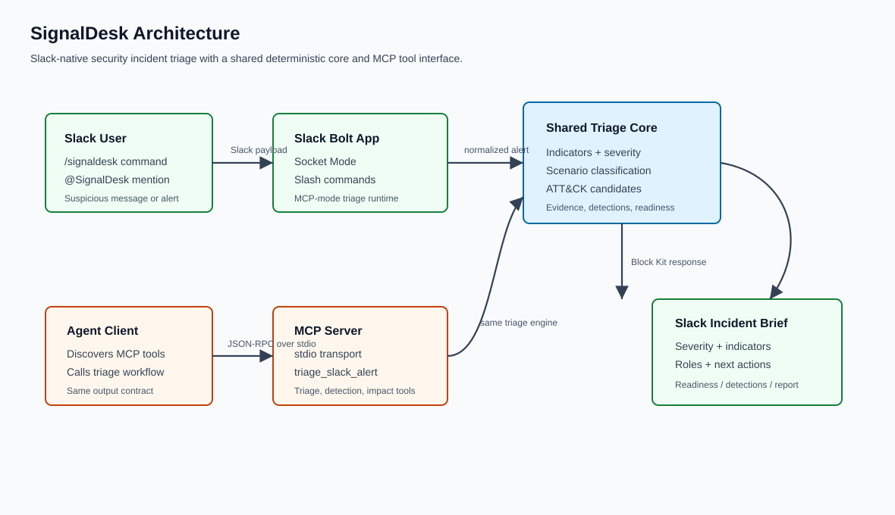

# SignalDesk Architecture

SignalDesk has two entry points into the same triage engine:

- Slack users invoke `/signaldesk`, mention the app, or use the message shortcut in a developer sandbox. In judged demo mode, `SIGNALDESK_TRIAGE_MODE=mcp` sends Slack triage through the MCP `triage_slack_alert` tool over stdio.
- MCP-capable clients call the stdio MCP tools directly.

Both paths produce the same evidence-gated incident brief with runtime label, scenario, severity, indicators, candidate ATT&CK techniques, evidence IDs, claim audit, detection opportunities, first-response readiness, response roles, Markdown report export, and guardrails. The Slack path can also create a dedicated public incident channel and post a kickoff message when the app has `channels:manage`.

The submission-ready diagram is available at `docs/architecture.svg`.
