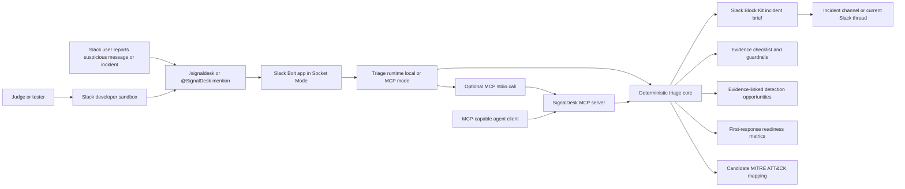

# Architecture

## Trust Boundaries

- Slack workspace data enters through slash commands or app mentions.
- Slack tokens remain in environment variables and must not be committed.
- MCP requests are local stdio by default, avoiding an exposed network service during the initial demo.
- In `SIGNALDESK_TRIAGE_MODE=mcp`, the Slack app delegates triage to the repo-local MCP stdio server.
- SignalDesk triage output is evidence-gated and must not claim compromise without log validation.
- First-response readiness measures output completeness; it does not prove real-world containment or incident impact.
- Detection opportunities are recommendations for human analysts; they do not imply the queried logs have already confirmed compromise.

## Current Components

- `src/slack/app.js`: Slack Bolt Socket Mode app.
- `src/slack/triageRuntime.js`: local/MCP runtime selector for Slack triage.
- `src/mcp/server.js`: MCP stdio server exposing security triage tools.
- `src/core/incidentBrief.js`: dependency-free triage engine shared by Slack and MCP.
- `scripts/demo.js`: reproducible local demo payload.
- `docs/architecture.svg`: submission-ready architecture diagram.

## Next Architecture Upgrade

- Add Slack RTS or Slack MCP retrieval for permission-aware channel/thread context.
- Add incident state storage with explicit retention controls.
- Add optional identity, proxy, and SaaS log connectors for live detection validation.
